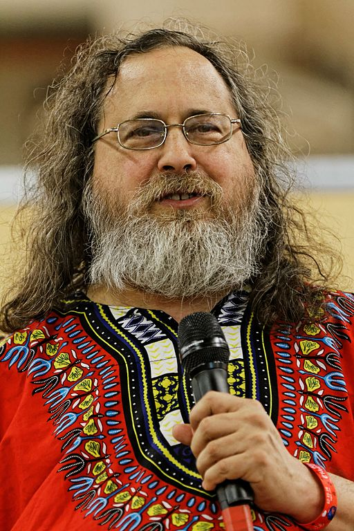
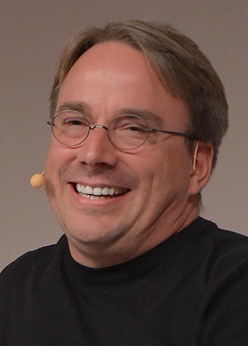
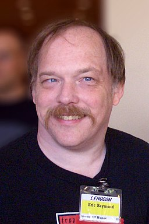
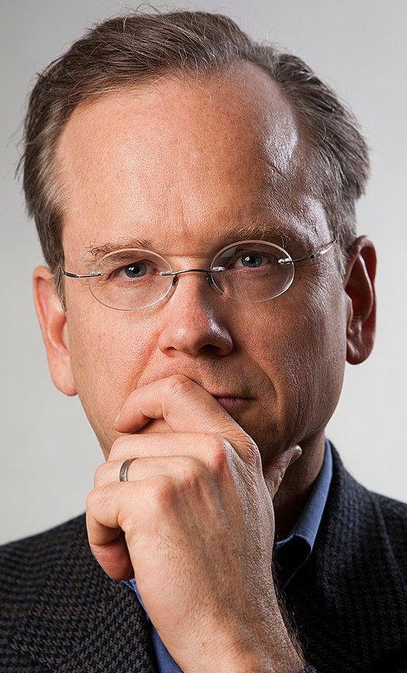

---
#
# Pour l'instant construit pour du pdf (LaTeX/Beamer) seulement avec toutes les extensions pandoc.
# 
# À compiler par :  pandoc -t beamer --template=etc/beamer-pandoc.tex --slide-level=2 --wrap=preserve -s -V aspectratio=169 libertes.md -o libertes.pdf
#
title: Informatique et libertés
subtitle: Université de Lille - DIU EIL
author:
- Bruno BEAUFILS
date: 20 juin 2019
title-image:
  file: gnu-head
logo:
- file: logo-univ-lille
  width: .2
  nl: true
- file: logo-eil
  width: .1
  nl: true
- file: logo-cc-by-nc-sa
  width: .1
keywords: logiciel libre, diu-eil
license: ccByNCSA # pas utilisé pour l'instant
theme: ulille
fontsize: 10pt
classoption: t
---


Introduction
============


## Bruno BEAUFILS

### **Jekyll**

- Maître de conférences en informatique ([IUT](https://www.iut.univ-lille1.fr) / [Département informatique](https://accueil.iut-info.univ-lille1.fr))
- <bruno.beaufils@univ-lille.fr>
- <https://beaufils.u-lille.fr>

\pause

### **Hide**

- Libriste convaincu depuis 1991
- <bruno+libre@boulgour.com>
- <https://bruno.boulgour.com>
- mastodon : [`@beaufils@mastodon.social`](https://mastodon.social/@beaufils)
- twitter : [`@brunobeaufils`](https://twitter.com/brunobeaufils)
- opinions souvent *un peu* fortes


## Présentation {.allowframebreaks}

### Biaisée

- enseignant-chercheur universitaire donc défenseur du **libre accès aux savoirs**
- utilisateur (et contributeur) de logiciels libres
- favorable à l'**extension de la liberté en dehors du cadre du logiciel**
- membre d'associations défendant et promouvant la liberté
    - [April](https://www.april.org)
    - [Debian France](https://france.debian.net)
    - [FDN](https://www.fdn.fr) et [Illyse](https://www.illyse.net)
    - [nos-oignons](https://nos-oignons.net)

### Incomplète

- je ne suis pas **juriste**
    - je vais faire **beaucoup de simplifications** (souvent grossières)
- licences libres **très** nombreuses
- objectifs
    - faire comprendre ce qu'est la **liberté appliquée à l'informatique**
        - aujourd'hui sans doute même restreinte au logiciel
    - convaincre de l'intérêt de la liberté *(et des dangers de sa privation)*
    - transmettre la volonté de participer
    
### Introductive

- liens pour aller plus loin
- une autre présentation suivra sur la liberté pour les ressources éducatives


Informatique
============


## Logiciel

### Ordinateur

Un ordinateur est une machine permettant d'effectuer des instructions :

- lecture | écriture d'informations depuis une zone de stockage
- manipulation (combinaison) d'informations

\pause

### Logiciel

Un logiciel est une suite d'instructions pour traiter de l'information sur un processeur

- faire des calculs
- stocker les résultats
- utiliser ces résultats

\pause

### Remarque

**L'intelligence est plus dans le logiciel que dans l'ordinateur**


## Autour du logiciel

### Environnement

Un logiciel ne *vit* pas seul

- création humaine
- interaction avec des humains
- communication avec d'autres logiciels

### Élaboration d'un logiciel

- **auteur**
  \dotfill
  *éditeur*
- **code source**
  \dotfill
  *langage de programmation*
- **code exécutable**
  \dotfill
  *binaire*

### Utilisation d'un logiciel

Un utilisateur est tributaire d'un éditeur dans le cas où

- il n'a pas les compétences d'édition
- il a besoin du service rendu par un logiciel


Droit
=====


## *Propriété* intellectuelle

**Ensemble des droits accordés sur des créations intellectuelles**

- regroupe des choses très différentes
    - **propriété littéraire et artistique**
        - droits d'auteurs
        - droits voisins du droit d'auteur (interprétation, production)
        - droits des bases de données
    - **propriété industrielle**
        - brevets
        - marques
        - dessins et modèles
- concepts nombreux et complexes
    - nombreuses interprétations différentes 
    - abus nombreux notamment des **ayants-droits**
        - cf [#CopyrightMadness sur Twitter](https://twitter.com/search?q=%23CopyrightMadness)
    - royaume des [sociétés de *gestion* des droits](https://fr.wikipedia.org/wiki/Soci%C3%A9t%C3%A9_de_gestion_des_droits_d%27auteur#Soci%C3%A9t%C3%A9s_de_gestion_des_droits_d'auteur_en_France) ([SACEM](https://www.sacem.fr), [ADAMI](https://www.adami.fr), [SACD](https://www.adami.fr), [SNE](https://www.sne.fr), etc.)
        - collecte et redistribution
- concerne **toutes** les œuvres de l'esprit
    - important dans l'éducation


## Droit moral *vs* droit patrimonial : principes

**Droit moral**

- droits de paternité, divulgation, à l'intégrité, au repentir (retrait)
- attaché à la personne **auteur** de l'œuvre
- perpétuel, inaliénable, imprescriptible
- simplification :
    - approche *française (ou européenne continentale)*
    - **droit d'auteur**
    
\pause

**Droit patrimonial**

- droits de représentation, reproduction
- cessible par contrat (**ayant-droit**)
- *initialement* pour la rétribution du travail de l'auteur
- limité dans le temps
    - ~ 70 ans post-mortem
    - **domaine public** après
- simplification :
    -  approche *américaine (ou anglo-saxonne)*
    - **copyright**


## Droit moral *vs* droit patrimonial : réalité

**[Convention de Berne](https://www.wipo.int/treaties/fr/text.jsp?file_id=283699)** (1886)

- 176 pays signataires (USA signe uniquement 1989)
- principes
    1. protection des œuvres dans tous les pays au moins comme les auteurs nationaux
    2. protection automatique (pas de formalité)
    3. protection indépendante de l'existence de la protection dans le pays d'origine
- les droits nationaux sont très différents
    - on essaie de les faire converger

\pause

En théorie les deux approches sont différentes mais en pratique :

- droits pas limités à l'auteur (ni même sa famille)
- revient souvent à donner beaucoup (*trop* et *de plus en plus*) de pouvoir aux ayants-droits
    - lobby très fort des sociétés de gestion et des gros producteurs
- **l'auteur est largemement absent des bénéfices**
    - l'objet même des droits patrimoniaux est détourné


## Exceptions

> Pendant la durée d'application des droits **patrimoniaux**, toute
> **reproduction** ou **représentation** de l’œuvre **sans le consentement et
> l'autorisation préalable** du titulaire de ces droits est en principe
> **interdite**.

\pause

La loi de chaque pays peut prévoir des exceptions au droit d'auteur. En France :

- droit d'auteur codifiés dans le [Code de la Propriété Intellectuelle](https://www.legifrance.gouv.fr/affichCode.do?cidTexte=LEGITEXT000006069414)
- des [exceptions](https://www.legifrance.gouv.fr/affichCodeArticle.do?cidTexte=LEGITEXT000006069414&idArticle=LEGIARTI000006278917) existent pour 
    1. la représentation privée et gratuite ;
    2. la **copie privée** (logiciels exclus sauf pour sauvegarde) ;
    3. sous réserve de l'**indication du nom de l'auteur et de la source** :
        - l'**analyse et les courtes citations** (but d’illustration ou de critique) ;
        - la représentation d'extrait pour l'information (**revues de presses**) ;
        - la diffusion intégral de discours publics (assemblées politiques, administratives, etc.) ;
        - la reproduction pour les catalogues de vente judiciaire ;
        - la représentation/reproduction d'œuvres **pédagogiques** pour l'**illustration en enseignement et de la recherche** ;
    4. la **parodie, le pastiche ou la caricature** ;
    5. les accès nécessaires au contenu de bases de données électroniques prévu par contrat ;
    6. la reproduction pour transmission via un intermédiaire (logiciels et BDD exclus) (mise en **cache**);
    7. la représentation à des **personnes handicapées** (en braille, etc.) ;
    8. la reproduction pour conservation accessibles au public sans avantage commercial (en **bibiliothèque**).


## Exception *pédagogique*

L'exception pédagogique est lié à des accords sectoriels

- poids des organisations collectives d'ayants-droits
- contrepartie du versement d’une rémunération négociée
- le logiciel est exclus de l'exception pédagogique


Informatique et droit
=====================


## Droit patrimonial du logiciel : contrat d'usage

- La création d'un logiciel est souvent une *œuvre* collective
    - éditeur = organisation (entreprise, associations, etc.)
    - protection des logiciels est limitée à son code
        - auteur du logiciel salarié $\Rightarrow$ droits appartiennent automatiquement à l'employeur

- Éditeur est *propriétaire* de ce qu'il produit
    - protégé par le droit d'auteur/copyright
    - libre d'utiliser ses droits comme bon lui semble

\pause

- Utilisateur et éditeur liés par un **contrat**
    - une **licence**
    - souvent nommé *CLUF* : Contrat de Licence Utilisateur Final

\pause

Une question importante est celle des **caractéristiques d'une licence**

- qui a le plus de pouvoir ?
    - rapport de force utilisateur--éditeur
- que permet-elle de faire avec le logiciel ?


## Logiciel libre

Principes posés par [Richard STALLMAN](https://stallman.org) en 1989

Un logiciel a une licence **libre** si elle permet de

::: incremental
- l'**utiliser sans restrictions**
  \dotfill
  liberté 0
- l'**étudier** et de le **modifier**
  \dotfill
  liberté 1
- le **redistribuer**
  \dotfill
  liberté 2
- **distribuer des versions modifiées**
  \dotfill
  liberté 3
:::

\pause

Si une licence restreint une de ces 4 libertés elle est **privatrice**

- le terme *propriétaire* est souvent utilisé (à tort !)
- le paiement (ou non) pour la signature du contrat est indépendant de la liberté

\pause

Beaucoup de CLUF précisent (en détail) :

- l'utilisation prévue
- l'interdiction de la *rétro-ingénierie*
- l'interdiction de la copie
    

## Détourner *(hacker)* le copyright : Copyleft 

Paradoxalement 

- les licences libres s'appuient souvent sur le droit d'auteur/copyright...
- ...**en le détournant via le [Copyleft](https://www.gnu.org/copyleft/copyleft.fr.html)**

    > « Pour mettre un logiciel sous copyleft, nous déclarons d'abord
    >  qu'il est sous copyright, ensuite nous ajoutons les conditions de
    >  distribution, qui sont un outil juridique donnant à chacun le droit
    >  d'utiliser, de modifier et de redistribuer le code du programme, ou tous
    >  les programmes qui en sont dérivés, mais seulement si les conditions de
    >  distribution demeurent inchangées. Ainsi, le code et ses libertés sont
    >  légalement indissociables »

L'éditeur utilise ses droits patrimoniaux pour forcer une utilisation respectant les libertés

- Copyright
- Conditions de distribution

Une licence *copyleftée* prend *souvent* un aspect viral


## Quelques malentendus

- libre = gratuit 
  \pause\hfill
  **FAUX**
  \vfill
 
- libre $\neq$
  commercial
  \pause\hfill
  **FAUX**
  \vfill

- téléchargement gratuit = libre
  \pause\hfill
  **FAUX**
  \vfill

- accès aux sources = libre
  \pause\hfill
  **FAUX**
  \vfill


## L'informatique : un monde à part

En informatique la plupart des licences protègent l'éditeur en cas de vice cachés

- clause de *non garantie*, livraison **telle quelle** (*as is*) dans les licences
    - **aucune garantie de non défectuosité**
- souvent obligation de paiement pour les corrections
- contradictoire avec la volonté des gros éditeurs de s'éloigner du droit d'auteur
- peu d'autres domaines où c'est le cas


Logiciels et libertés
=====================


## Intérêts du modèle libre

**Technique**

- Fiabilité
- Pérennité
- Interopérabilité

**Économique**

- Coût
    - **+** Coût des licences
    - **+** Protection légale
    - **-** Formation
- Indépendance technologique

**Philosophique**

- Diffusion de la connaissance et du savoir
- Transparence


## Logiciels libres et code ouvert

**Open-Source**

- on n'insiste pas sur l'utilisation mais plus sur la disponibilité (libertés 1, 2 et 3)
    - contrainte sur l'utilisation possible
- apprécié des gros éditeurs
    - permet d'utiliser le travail des autres à peu de frais
      \hfill
      *MacOS X*
    - permet d'*externaliser* le développement
- **pouvoir à l'éditeur**

**Free (and Libre) Open Source Software** (FLOSS)

- le point important est la liberté 0 (aucune restriction à l'utilisation)
- confusion entretenue par le sens de *free* en anglais
    - libre
    - gratuit
- **pouvoir à l'utilisateur**

<!-- https://fr.flossmanuals.net/faq-floss-manuals-francophone/quest-ce-que-lopen-source-et-quelle-est-la-difference-entre-free-libre-et-open/ -->


## Des licences *libres* en veux-tu en voilà

Depuis la création de la GNU GPL beaucoup ont donné leur version de la liberté

- quasiment chaque éditeur a créé sa licence *libre*
- des organisations ont donné une interprétation de la liberté dans le logiciel
    - les [principes du logiciel libre selon Debian (DFSG)](https://www.debian.org/social_contract.fr.html#guidelines) sont les plus acceptés
    
Quelques exemples :

- [GNU General Public License](https://www.gnu.org/copyleft/gpl.html)
- [GNU Lesser General Public License](https://www.gnu.org/copyleft/lgpl.html)
- [MIT Public License](https://opensource.org/licenses/mit-license.php)
- [BSD License](https://www.freebsd.org/copyright/license.html)

Il existe des listes commentées

- par la [Free Software Foundation](https://www.fsf.org)
  \hfill
  <https://www.gnu.org/licenses/license-list.fr.html>
- par l'[Open Source Initiative](https://opensource.org)
  \hfill
  <https://opensource.org/licenses>
  

## Une licence libre simple : WTFPL

La [WTFPL](http://www.wtfpl.net) a été crée en réaction à un ras le bol du
poids du droit en informatique :

```
        DO WHAT THE FUCK YOU WANT TO PUBLIC LICENSE 
                    Version 2, December 2004 

 Copyright (C) 2004 Sam Hocevar <sam@hocevar.net> 

 Everyone is permitted to copy and distribute verbatim or modified 
 copies of this license document, and changing it is allowed as long 
 as the name is changed. 

            DO WHAT THE FUCK YOU WANT TO PUBLIC LICENSE 
   TERMS AND CONDITIONS FOR COPYING, DISTRIBUTION AND MODIFICATION 

  0. You just DO WHAT THE FUCK YOU WANT TO. 
```


## Extension du domaine de la lutte : Creative Commons

Principes posés par [Lawrence LESSIG](http://www.lessig.org/about) en 2002 :

- Appliquer les principes du logiciel libre à toutes les types œuvres de l'esprit
    - notamment en ligne
- S'appuyer sur la volonté de l'auteur pour faciliter la réutilisation créative, le remix, etc
- Passer d'une approche « *Tous droits réservés* » à « **certains droits réservés** »

\pause\vfill

Un système de licences modulables en 4 *pôles*

- **Attribution de Paternité**
  \hfill
  `CC` \ccAttribution
- **Pas d'utilisation commercial**
  \hfill
  `NC` \ccNonCommercial
- **Pas de Modification**
  \hfill
  `ND` \ccNoDerivatives
- **Partage dans les Mêmes Conditions**
  \hfill
  `SA` \ccShareAlike

\pause\vfill

Au final 6+1 licences différentes, avec des signalétiques adadptées

| CC-0    | CC-BY | CC-BY-SA | CC-BY-ND | CC-NY-NC  | **CC-BY-NC-SA** | CC-BY-NC-ND |
|:-------:|:-----:|:--------:|:--------:|:---------:|:---------------:|:-----------:|
| \cczero | \ccby | \ccbysa  | \ccbynd  | \ccbynceu | \ccbyncsaeu     | \ccbyncndeu |


## Logiciels libres {.allowframebreaks}

- Distributions de systèmes d'exploitations *complets*
    - génériques : [Debian](https://www.debian.org), [Ubuntu](https://ubuntu.com)
    - adaptés : [Openmediavault](https://www.openmediavault.org), [OSMC](https://osmc.tv), [pfSense](https://www.pfsense.org)
- Outils systèmes
    - éditeur : [Emacs](https://www.gnu.org/s/emacs), [vi](https://thomer.com/vi/vi.html), [Thonny](https://thonny.org)
    - contrôleur de version : [git](https://git-scm.com)
    - interpréteur et compilateur : [Python](https://www.python.org), [GCC](https://gcc.gnu.org)
    - émulateur : [VirtualBox](https://www.virtualbox.org)
- Accès aux services de l'Internet
    - web : [Firefox](https://www.mozilla.org/fr/firefox/)
    - email : [Thunderbird](https://www.mozilla.org/fr/thunderbird)
    - distribution de fichiers : [TransmissionBT](https://www.transmissionbt.com)
- Manipulation multimédia
    - création : [Gimp](https://www.gimp.org), [Inkscape](https://www.inkscape.org/fr), [Blender](https://www.blender.org)
    - visualisation : [VLC](https://www.videolan.org/index.fr.html)
- Gestion bureautique : [LibreOffice](https://libreoffice.org)
- Jeux
    - [Minetest](https://www.minetest.net)
    - [FlightGear Flight Simulator](https://www.flightgear.org)
    - [GCompris](https://gcompris.net)

Une liste de logiciels libres est disponible sur [Framalibre](https://framalibre.org)


## Contribuer

Utiliser c'est déjà participer mais **contribuer** c'est mieux

\pause

Il ne faut pas se retenir : c'est simple, facile et gratifiant

- **commencer doucement**
  - remontée de problèmes, bugs
  - documentation
    - traduction
    - relecture/correction
    - rédaction

\pause

- **commencer sûrement**
  - s'informer [Framablog](https://www.framablog.org)
  - soutenir (adhérer ou financer) les associations
    - [APRIL](https://www.april.org)
    - **[Framasoft](https://framasoft.org)**
    - [LQDN](https://www.laquadrature.net/fr)
    - [FFDN](https://www.ffdn.org)
  - *évangéliser* autour de soi


Références
==========


## Rapide histoire de l'industrie informatique

### Années 1960-1970

- Informatique dominée par l'industrie du **matériel**
  \hfill
  *(IBM, DEC, HP)*
- Logiciel développé en mode *universitaire*

### Années 1980-1990

- Arrivée du PC
- Développement de l'*industrie* du **logiciel**
  \hfill
  *(Microsoft, Novell, Sun, Oracle)*
  
### Années 2000-

- Arrivée des périphériques mobiles et développement de l'Internet
- Développement de l'*industrie* des **données**
  \hfill
  *(Google, Amazon, Facebook, Apple)*
  <!--*(Baidu, Alibaba, Tencent, Xiaomi)*-->


## Repères historiques clés : industrie informatique

- **1911** : Création de IBM
- **1951** : Lancement de l'[UNIVAC 1](https://fr.wikipedia.org/wiki/UNIVAC_I)
- **1968** : Création de Intel
- **1970** : Lancement du [DEC PDP 11](https://fr.wikipedia.org/wiki/PDP-11)
- **1971** : Lancement de l'[Intel 4004](https://fr.wikipedia.org/wiki/Intel_4004)
- **1975** : Création de Microsoft
- **1976** : Création de Apple
- **1977** : Création de Oracle
- **1981** : Lancement de l'[IBM PC](https://fr.wikipedia.org/wiki/IBM_PC)
- **1994** : Création de Amazon
- **1998** : Création de Google
- **2004** : Création de Facebook
- **2006** : Lancement des services [AWS](https://fr.wikipedia.org/wiki/Amazon_Web_Services)
- **2007** : Lancement de l'[iPhone](https://fr.wikipedia.org/wiki/IPhone)


## Repères historiques clés : liberté et informatique

- **1983**
  - Création du projet [GNU](https://www.gnu.org) (puis de la [FSF](https://www.fsf.org)) par [Richard STALLMAN](https://stallman.org)
  - **[éthique du hacker](https://fr.wikipedia.org/wiki/L\%27\%C3\%A9thique_hacker)** (plaisir)
    $\neq$
    éthique protestante (devoir moral et économique)

- **1991**
  - Distribution de Linux par [Linus TORVALDS](https://fr.wikipedia.org/wiki/Linus_Torvalds)
  - sous licence GNU GPL

- **1993**
    - Apparition des distributions **GNU/Linux**

- **1998**
    - [Eric RAYMOND](http://www.catb.org/esr) écrit un essai intitulé « *[La cathédrale et le bazaar](http://www.linux-france.org/article/these/cathedrale-bazar/cathedrale-bazar.html)* »
    - Création de l'[Open Source Initiative](https://opensource.org)

- **2001**
    - [Jimmy WALES](https://fr.wikipedia.org/wiki/Jimmy_Wales) et [Larry SANGER](https://fr.wikipedia.org/wiki/Larry_Sanger) créent [Wikipedia](https://wikipedia.org)

- **2002** 
    - [Lawrence LESSIG](https://fr.wikipedia.org/wiki/Lawrence_Lessig) crée [Creative Commons](https://creativecommons.org/licenses)


## Repères visuels

|                                          |                                                                |                                         |                                                  |
|:----------------------------------------:|:--------------------------------------------------------------:|:---------------------------------------:|:------------------------------------------------:|
| { width=20% }   | { width=21.5% }                         | { width=20% }      | { width=18% }            |
| [Richard STALLMAN](https://stallman.org) | [Linus TORVALDS](https://fr.wikipedia.org/wiki/Linus_Torvalds) | [Eric RAYMOND](http://www.catb.org/esr) | *[Lawrence LESSIG](http://www.lessig.org/about)* |


## Références {.allowframebreaks}

- **[Internet ou la révolution du partage](https://www.arte.tv/fr/videos/077346-000-A/internet-ou-la-revolution-du-partage)**
    - version condensée de [*La bataille du libre*](http://tempsnoir.com/film/internet-ou-la-revolution-du-partage) de Philippe BORREL
    - visible gratuitement jusqu'au 30 août 2019
    
- **[Contenus numériques : droit d'auteur et licences libres](https://stph.scenari-community.org/ln/da/co/da.html)**
    - supports d'un cours de Lionel Maurel (alias *Calimaq*)
- **[Cuberstructure. L'Internet, un espace politique](https://cyberstructure.fr)**
    - livre de [Stéphane BORTZMEYER](https://cyberstructure.fr), publié chez [C&F Éditions](https://cfeditions.com/public) en 2018
- **[Utopie du logiciel libre](http://lepassagerclandestin.fr/fileadmin/assets/catalog/essais/Utopie_logiciel_libre__Broca__Le_passager_clandestin.pdf)**
    - livre de Sébastien BROCA, publié chez *Le passager clandestin* en 2013
    - auteur invité de l'émission *« Place de la toile »* sur France Culture le [28 décembre 2013](http://rf.proxycast.org/841402162318675968/10465-28.12.2013-ITEMA_20567547-0.mp3)
- **[L'éthique hacker et l'esprit de l'ère de l'information](http://www.editions-exils.fr/exils/l-ethique-hacker-et-l-esprit-de-l-ere-de-l-information)**
    - livre de Pekka HIMANEN, publié chez Exils en 2001
- **[The Cathedral and the Bazaar](http://www.catb.org/~esr/writings/homesteading)**
    - article d'[Eric RAYMOND](http://www.catb.org/esr)
    - version française : *[La cathédrale et le bazaar](http://www.linux-france.org/article/these/cathedrale-bazar/cathedrale-bazar.html)*


## Crédits

- Cette présentation et son code source sont mises à disposition selon les termes de la [Licence Creative Commons Attribution - Utilisation non commerciale - Partage dans les Mêmes Conditions 4.0 International](https://creativecommons.org/licenses/by-nc-sa/4.0/legalcode.fr) \ccbyncsaeu.

    \vfill

- Photos
    - Richard STALLMAN : Thesupermat [CC BY-SA 3.0](https://creativecommons.org/licenses/by-sa/3.0)
    - Linus TORVALDS : Krd (photo)Von Sprat (crop/extraction) [CC BY-SA 3.0](https://creativecommons.org/licenses/by-sa/3.0)
    - Eric RAYMOND : Erc_S_Raymond_and_company.jpg: jerone2derivative work: Bilby [CC BY-SA 2.0](https://creativecommons.org/licenses/by-sa/2.0)
    - Lawrence LESSIG : Lessig 2016 [CC BY 2.0](https://creativecommons.org/licenses/by/2.0)

    \vfill

- La présentation au format PDF est disponible à \url{http://bruno.boulgour.com/talks/2019-06-20-diu-eil-libre}

    \vfill

- Le code source Markdown-Pandoc de la présentation est disponible à <https://github.com/b3/talks-20190620-diu-eil-libre>

    \vfill

- La dernière modification de ce document a eu lieu le 21 juin 2019 à 20h46

<!-- Local Variables: -->
<!-- time-stamp-active: t -->
<!-- time-stamp-pattern: "-7/eu lieu le %:d %:b %:y à %:Hh%02M$" -->
<!-- End: -->
