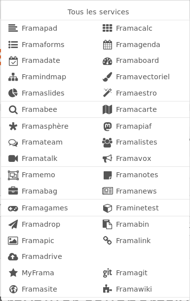
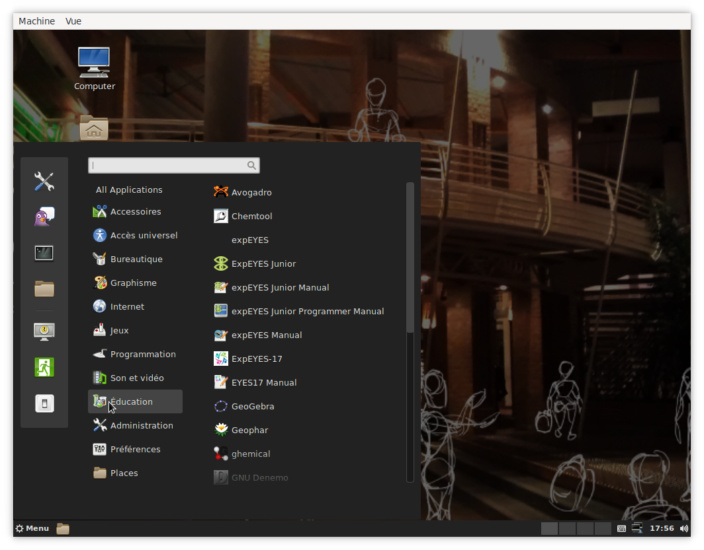

---
#
# Pour l'instant construit pour du pdf (LaTeX/Beamer) seulement avec toutes les extensions pandoc.
# 
# À compiler par :  pandoc -t beamer --template=etc/beamer-pandoc.tex --lua-filter=etc/latex-pandoc.lua --slide-level=2 --wrap=preserve -s -V aspectratio=169 partage.md -o partage.pdf
#
title: Informatique et partage
subtitle: Université de Lille - DIU EIL
author:
- Bruno BEAUFILS
date: 2 juillet 2019
title-image:
  file: rel-fr
logo:
- file: logo-univ-lille
  width: .2
  nl: true
- file: logo-diu-eil
  width: .1
  nl: true
- file: logo-cc-by-nc-sa
  width: .1
keywords: diu-eil, informatique rel, oer,
license: ccByNCSA # pas utilisé pour l'instant
theme: ulille
fontsize: 10pt
classoption: t
---

Introduction
============

## Résumé de l'épisode précédent {.allowframebreaks}

### Droits

- *propriété intellectuelle*
    - **littéraire et artistique**
    - industrielle
- droits
    - moral : paternité, divulgation, integrité, repentir
    - patrimonial : représentation, reproduction
- [exceptions aux droits patrimoniaux](https://www.legifrance.gouv.fr/affichCodeArticle.do?cidTexte=LEGITEXT000006069414&idArticle=LEGIARTI000006278917)
    - plusieurs types d'exception (autorisation d'utilisation)
    - exception *pédagogique*
        - accords sectoriels
        - logiciel exclus de l'exception pédagogique

### Logiciels libres

- contrat entre éditeur et utilisateur = licence

- licence fixe ce que l'*ayant-droit* permet sur son logiciel

- licence libre autorise
    - **utilisation sans restrictions**
      \dotfill
      liberté 0
    - **étude** et **modification**
      \dotfill
      liberté 1
    - **redistribution**
      \dotfill
      liberté 2
    - **distribution des versions modifiées**
      \dotfill
      liberté 3

### Creative Commons

- Licences modulables sous 4 axes
    - paternité
    - utilisation commerciale
    - modification
    - conditions de partage
- 6+1 licences différentes, avec des signalétiques adaptées, applicables à toutes les oeuvres de l'esprit

| CC-0    | CC-BY | CC-BY-SA | CC-BY-ND | CC-NY-NC  | **CC-BY-NC-SA** | CC-BY-NC-ND |
|:-------:|:-----:|:--------:|:--------:|:---------:|:---------------:|:-----------:|
| \cczero | \ccby | \ccbysa  | \ccbynd  | \ccbynceu | \ccbyncsaeu     | \ccbyncndeu |

## Question : logiciel développé par un élève en cours

- Réponse difficile
    - je ne suis pas juriste
    - interprétation des textes faites uniquement lors d'un jugement
- Intuition : **l'élève a les droits patrimoniaux sur le logiciel qu'il produit** 
- La règle de base s'applique 
    - [Article L113-1 du CPI](https://www.legifrance.gouv.fr/affichCodeArticle.do?idArticle=LEGIARTI000006278881&cidTexte=LEGITEXT000006069414) : les droits appartiennent à la personne qui crée l'oeuvre

      > La qualité d’auteur appartient, sauf preuve contraire, à celui ou à
      > ceux sous le nom de qui l’œuvre est divulguée
        
       
    - exception : [Article L113-9 du CPI](https://www.legifrance.gouv.fr/affichCodeArticle.do?idArticle=LEGIARTI000006278890&cidTexte=LEGITEXT000006069414) : création dans le cadre de ses fonctions par un employé $\Rightarrow$ employeur a les droits

      > Sauf dispositions statutaires ou stipulations contraires, les droits
      > patrimoniaux sur les logiciels et leur documentation créés par un ou
      > plusieurs employés dans l'exercice de leurs fonctions ou d'après les
      > instructions de leur employeur sont dévolus à l'employeur qui est seul
      > habilité à les exercer.
        
      Le cas d'un élève ou d'un étudiant n'est pas dans les exceptions
- Ambiguité
    - si le logiciel est *original* (choix *propre* de l'élève) : pas de problème
    - si le logiciel n'est pas *original* : le juge tranchera `;-)`
        - tous les élèves répondent de manière identique à la consigne

## Contribuer aux logiciels libres

Utiliser c'est déjà participer mais **contribuer** c'est mieux

\pause

Il ne faut pas se retenir : c'est simple, facile et gratifiant

- **commencer doucement**
  - remontée de problèmes, bugs
  - documentation
    - traduction
    - relecture/correction
    - rédaction

\pause

- **commencer sûrement**
  - s'informer [Framablog](https://www.framablog.org)
  - soutenir (adhérer ou financer) les associations
    - [APRIL](https://www.april.org)
    - **[Framasoft](https://framasoft.org)**
    - [LQDN](https://www.laquadrature.net/fr)
    - [FFDN](https://www.ffdn.org)
  - *évangéliser* autour de soi

\pause

Comment utiliser tout ça dans votre quotidien d'enseignants en informatique ?

Outils
======

## Les outils que vous connaissez

Vous avez vu les outils essentiels

- **description de document**
  \dotfill
  [Markdown](https://commonmark.org)
    - texte
    - simple
    - transformable en d'autres format faciement (via [pandoc](https://pandoc.org) par exemple)
        - dites adieu à Word !
- **gestion de version**
    \dotfill
    [git](https://git-scm.com)
    - serveur de partage
      \hfill
      [*gitlab*](https://about.gitlab.com)
- **langage de programmation**
  \dotfill
  [Python](https://python.org)
- **système d'exploitation**
  \dotfill
  [GNU](https://gnu.org)/[Linux](https://fr.wikipedia.org/wiki/Linux)

Ils suffisent à **tout faire** \pause ou presque :-)

\pause\vfill

C'est ce que j'utilise pour mes cours

## Ceux qui vous manquent

- **gestion de figures / images**
    - privilégier les formats vectoriels (**SVG**)
    - outils : [Inkscape](https://inkscape.org/fr) / [LibreOffice Draw](https://fr.libreoffice.org/discover/draw)
    - séparer figures et document
    
    \pause

- **gestion de présentation et déroulé pédagogique**
    - [Jupyter](https://jupyter.org)
    - utilise markdown et python
    - simplifie la prise en main et l'exécution des exercices

\pause

**Des formats de fichier simples garantissent un partage facile**

## Des services : la galaxie Framasoft { .allowframebreaks }

:::::: {.columns}
::: {.column width=33% }
{ width=80% }
:::
::: {.column width=67% }
- Plein de services hébergés sur les serveurs de l'association
    - [Framagit](https://framagit.org)
    - [Framavectoriel](https://framavectoriel.org)
    - [Framapad](https://framapad.org)
    - [Framatube](https://framatube.org)
- Services auto-hébergeables (lycée, associations, personnels, etc.)
    - [Le jardin de Framacloud](https://framacloud.org/fr/cultiver-son-jardin/) contient les recettes d'installation
    - Un [chatons](https://chatons.org) de votre choix
        - *Collectif des Hébergeurs Alternatifs,Transparents, Ouverts, Neutres et Solidaires*
:::
::::::

## Freeduc-JBART { .allowframebreaks }

### « Mon lycée ne me permet pas d'utiliser Linux ! »

- Ça va **forcément** venir (dans le [programme](http://cache.media.education.gouv.fr/file/CSP/41/2/1e_Numerique_et_sciences_informatiques_Specialite_Voie_G_1025412.pdf) il faut utiliser un **système d'exploitation libre**)
    - conditions pas idéales pour l'instant dans l'académie
    - il faut un peu de patience 
- On peut s'arranger sans *trop* se fatiguer
    - grâce à [Georges KHAZNADAR](http://georges.khaznadar.fr/docs/speeches)
        - enseignant au lycée Jean BART de Dunkerque
        - développeur Debian
        - créateur/mainteneur d'une distribution Linux *live* pour le lycée
    - via [Freeduc-JBART](https://usb.freeduc.org/jbart.html) 
        1. télécharger puis décompresser le fichier [`jbart-19.06-16G.iso.gz`](https://usb.freeduc.org/freeduc-usb/freeduc-jbart/19.06/jbart-19.06-16G.iso.gz)
        2. installer le logiciel [Etcher](https://www.balena.io/etcher/) (*disponible sous Linux/Mac/Windows*)
        3. graver le fichier sur une clé de 16 Go
        4. démarrer un ordinateur à partir de la clé gravée

Détails sur <https://usb.freeduc.org/freeduc-usb/freeduc-jbart/index.fr.html>

**Même environnement au lycée qu'à la maison**

## { .plain }

| Le bureau de Freeduc-JBART                      |
|:-----------------------------------------------:|
| { width=60% } |

Ressources pédagogiques
=======================

## Droits et utilisation

Construire des ressources pédagogiques nécessite des images, figures, vidéos, etc.

- Attention l'exception *pédagogique* peut-être **ambigue**
    - accords sectoriels
    - **toujours** vérifier la licence des ressources utilisées
    - éviter d'utiliser des ressources (images, vidéos, etc.) sans connaître la licence d'usage
        - ne pas hésiter à **contacter l'auteur** si nécessaire

- Une solution : **n'utiliser que des ressources *sûres***
    - avec par exemple une licence [CC](http://creativecommons.fr)

- Quelques services sûrs
    - Médiathèque : [Wikimedia Commons](https://fr.wikipedia.org/wiki/Wikimedia_Commons)
        - les ressources de Wikipedia sont issus de la [médiathèque Commons](http://commons.wikimedia.org)
    - Moteur de recherche 
        - ad-hoc comme [CC Search](https://search.creativecommons.org)
        - option des moteurs de recherche *classiques* (souvent un peu [dur à trouver](https://www.skell.fr/prof/Fic15licencesCC.pdf))
        <!-- tout en bas de https://www.google.com/advanced_image_search -->

\pause

Et pour les cours et exercices ?

## Ressources Éducatives Libres (*Open Educational Resources*)

> Les ressources éducatives libres (REL) sont des matériaux d'enseignement,
> d'apprentissage ou de recherche appartenant au **domaine public** ou **publiés
> avec une licence de propriété intellectuelle permettant leur utilisation,
> adaptation et distribution** à titre gratuit.

\pause

- Définition par l'[UNESCO](https://fr.unesco.org/themes/tic-education/rel) en 2002
    - Effort également supporté par l'OCDE, le Commonwealth et de nombreux autres organismes internationaux
    - [Recommandations de l'UNESCO aux États](http://www.unesco.org/new/fileadmin/MULTIMEDIA/HQ/CI/CI/pdf/Events/French_Paris_OER_Declaration.pdf) pour favoriser et encourager les REL en 2012
    - Quelques tensions sur la définition concernant leur nature, source et leur degré d'*ouverture*
- Objectifs
    - **création et distribution de ressources éducatives libres et gratuites**
    - **ressources d'apprentissage *et* de soutien pour les enseignants**
- Beaucoup de projets de développement un peu partout et à tous les niveaux
    - [Open Education Consortium](https://www.oeconsortium.org)
    - [Wikieducator](https://wikieducator.org)
- Il reste du travail de **structuration des communautés** et de **dissémination**
    - surtout en informatique (paradoxalement)
        - peu de pays ont pris conscience *tôt* du rôle de l'enseignement de l'informatique
        - contre-exemple brittanique

<!-- https://www.capetowndeclaration.org/read-the-declaration -->
<!-- https://www.capetowndeclaration.org -->

## La liberté pour les contenus éducatifs

Les REL sont des oeuvres du domaine publique ou distribués de manière à
garantir à l'utilisateur une permission gratuite et permanente de s'engager
dans les [**activités 5R**](http://opencontent.org/definition)

\pause

- **Retain** - the right to make, own, and control copies of the content
    - (e.g., download, duplicate, store, and manage)
    \pause
- **Reuse** - the right to use the content in a wide range of ways
    - (e.g., in a class, in a study group, on a website, in a video)
    \pause
- **Revise** - the right to adapt, adjust, modify, or alter the content itself
    - (e.g., translate the content into another language)
    \pause
- **Remix** - **the right to combine the original or revised content with other material to create something new**
    - (e.g., incorporate the content into a mashup)
    \pause
- **Redistribute** - the right to share copies of the original content, your revisions, or your remixes with others
    - (e.g., give a copy of the content to a friend)[10]    

\pause

Proches de l'idée du logiciel libre

## Contribuer à la production

- Le mouvement du logiciel libre a réussi grâce aux communautés de développeurs et d'utilisateurs
- Le mouvement des REL réussira s'il réussi à créer des communautés aussi dynamique
    - vous êtes le public rêvé pour ça
    - vous avez les outils pour créer des ressources libres
    - vous avez **intérêt** à contribuer pour faciliter votre travail
    
\pause

Quelques *conseils*
    
- [Privilégier la licence Creative Commons Paternité (CC BY) dans l’éducation](https://framablog.org/2009/12/02/licence-creative-commons-paternite-et-education/)
- Utiliser les formats simples
    - facilite le mélange (*remix*)
- Demander de l'aide quand vous en avez besoin
    - à nous
    - entre vous

Références
==========

## Enseignement de l'informatique

La communauté commence à s'organiser via notamment des rencontres entre 

- enseignants-chercheurs en informatique
- enseignants-chercheurs en science de l'éducation
- **praticiens** (aka les gens qui font le travail pour de vrai : **vous**)

**Moments d'échanges important pour forger une communauté**

\pause

Quelques exemples accessibles

- [**Journée de l'Enseignement de l'Informatique et de l'Algorithmique**](http://jeia.fil.univ-lille1.fr) 
  \hfill
  [`@JeiaLille`](https://twitter.com/JeiaLille)
  - tous les ans ici (à l'Université de Lille)
- [**educode.be**](http://www.educode.be)
  - colloque annuel international dédié à l’éducation, aux pratiques et à la recherche dans les domaines liés au numérique
  - le prochain : 27 septembre 2019, *autour* de Bruxelles
- [**Didapro - Didastic**](https://www.didapro.org)
  - colloques francophones de didactique de l'informatique
  - le prochain : [du 5 au 7 février 2020 à Lille](https://www.didapro.org/8)

## Quelques liens 

- Des listes de ressources
    - <http://catalogue.education-et-numerique.org/>
    - <https://data.abuledu.org/>
    - <http://chticode.info> (pas de licence précisée)
- Des livres libres 
    - <https://fr.flossmanuals.net/>
- Logiciels et services pour les REL
    - <https://www.abuledu.org/>
- Des ressources autour du réseau 
    - <https://www.ffdn.org/wiki/doku.php?id=formations>

## Crédits

- Cette présentation et son code source sont mises à disposition selon les termes de la [Licence Creative Commons Attribution - Utilisation non commerciale - Partage dans les Mêmes Conditions 4.0 International](https://creativecommons.org/licenses/by-nc-sa/4.0/legalcode.fr) \ccbyncsaeu.

    \vfill

- La présentation au format PDF est disponible à \url{http://bruno.boulgour.com/talks/2019-06-20-diu-eil-libre}

    \vfill

- Le code source Markdown-Pandoc de la présentation est disponible à <https://github.com/b3/talks-20190620-diu-eil-libre>

    \vfill

- La dernière modification de ce document a eu lieu le 4 juillet 2019 à 17h47

<!-- Local Variables: -->
<!-- time-stamp-active: t -->
<!-- time-stamp-pattern: "-7/eu lieu le %:d %:b %:y à %:Hh%02M$" -->
<!-- End: -->
